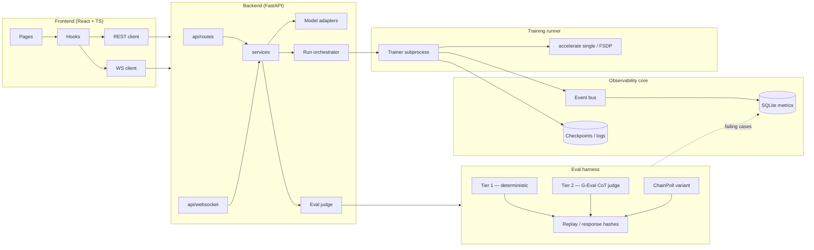

# LLM-W

A local-first LLM fine-tuning workbench with a research-backed observability and evaluation harness, benchmarked across Apple Silicon (MPS) and cloud (CUDA) backends.

## Architecture



## Tech stack

| Layer | Stack |
|---|---|
| Frontend | React 19, TypeScript 5, Vite 7, Tailwind 3, shadcn/ui (Radix), Zustand 4, TanStack Query 5, Recharts 2 |
| Backend | Python 3.11+, FastAPI, SQLAlchemy 2 (async), Pydantic 2, Alembic, Uvicorn, aiosqlite |
| ML | PyTorch 2.2+, HuggingFace Transformers, PEFT (LoRA/QLoRA), TRL, `accelerate` (FSDP), bitsandbytes |
| Evaluation | `instructor` (Pydantic-validated judge outputs), OpenAI Structured Outputs, OpenAI Moderation |
| Storage | SQLite (single-file, WAL) for metrics + config versions + eval history |
| Transport | REST for CRUD, WebSocket for streaming logs and metrics |
| Packaging | Docker Compose for the workbench; native PyTorch subprocess for GPU/MPS training |

## Quickstart

```bash
git clone https://github.com/freddysongg/LLM-W.git
cd LLM-W
docker-compose up
```

Then open [http://localhost:5173](http://localhost:5173).

**First run:** up to 20 minutes (image build + HuggingFace cache warming). **Subsequent runs:** ≤ 2 minutes.

| Service | Port | Purpose |
|---|---|---|
| Frontend (nginx + Vite build) | 5173 | UI |
| Backend (FastAPI) | 8000 | REST + WebSocket |

Training runs execute natively on the host (MPS on Apple Silicon, CUDA on Linux) — the Docker container orchestrates but does not own the GPU. This is intentional: it avoids the Docker-on-Mac GPU gap.

## Feature matrix

| Area | v0.4 status |
|---|---|
| 14-stage instrumented run lifecycle | Implemented |
| QLoRA / LoRA PEFT training | Implemented |
| Atomic checkpointing (write-to-temp + rename) | Implemented |
| WebSocket metric streaming | Implemented |
| Config versioning (YAML + SQLite) | Implemented |
| Watchdog (heartbeat, rank-aware kill) | Implemented |
| Run comparison view | Implemented |
| Model architecture explorer | Implemented |
| AI config recommender | Implemented |
| Cross-hardware benchmarks (M1 Pro / M4 Pro / A10) | In progress — see [BENCHMARKS.md](BENCHMARKS.md) |
| Two-tier LLM-as-Judge eval harness | In progress — see [EVAL.md](EVAL.md) |
| Calibration on 50 held-out human labels | In progress |
| CI quality gate (`llmw eval`) | Planned |
| Distributed training (FSDP via `accelerate`) | Planned |
| Modal cloud dispatcher | Stubbed (out of scope for v4) |
| DPO / ORPO / RLHF | Out of scope |
| Multi-model panel judges (PoLL) | Out of scope |

## Benchmarks

Numbers are populated by the benchmarking workstream — same codepath, three devices. See [BENCHMARKS.md](BENCHMARKS.md) for the locked config, the metric schema, and cost governance.

| Backend | tokens/sec | peak mem | wall clock | $/1M tokens |
|---|---|---|---|---|
| M1 Pro (MPS) | _TBD_ | _TBD_ | _TBD_ | $0 |
| M4 Pro (MPS) | _TBD_ | _TBD_ | _TBD_ | $0 |
| A10 (CUDA QLoRA) | _TBD_ | _TBD_ | _TBD_ | _TBD_ |

## Demo


45–60s walkthrough: QLoRA run start → live metric streaming → checkpoint event → run-comparison view.

## Docs

- [`SPEC.md`](SPEC.md) — canonical product and technical specification (architecture, data models, REST/WS protocol, run lifecycle, failure recovery)
- [`BENCHMARKS.md`](BENCHMARKS.md) — hardware benchmarking study (setup, system + quality metrics, cost governance, FSDP scaling)
- [`EVAL.md`](EVAL.md) — two-tier LLM-as-Judge harness (rubrics, calibration methodology, replay, CI gate)
- [`LICENSE`](LICENSE) — MIT
- [`CITATION.cff`](CITATION.cff) — how to cite this software

## Research citations

Every design choice traces back to a named source. Short list here; full bibliography forthcoming in [`docs/references/`](docs/references/).

- **R1** — Liu et al. 2023, *G-Eval*. Chain-of-thought scoring for Tier-2 judge. [arXiv:2303.16634](https://arxiv.org/abs/2303.16634)
- **R3** — Hamel Husain, *Critique Shadowing*. Binary pass/fail labeling + TPR/TNR calibration methodology. [hamel.dev](https://hamel.dev/blog/posts/llm-judge/)
- **R4** — *ChainPoll*. N-call majority vote for hallucination detection. [arXiv:2310.18344](https://arxiv.org/abs/2310.18344)
- **R5** — *MultiChallenge* (ACL 2025). Validates binary rubrics reach ≈93% alignment with human evaluation.
- **R6** — Anthropic, *Constitutional AI*. Safety rubric dimension design.
- **R7** — OpenAI Structured Outputs and [`instructor`](https://github.com/instructor-ai/instructor). Pydantic-validated judge outputs with reasoning-before-score ordering.
- **R8** — Confident AI, *DeepEval*. Reference implementations for 60+ evaluation metrics.
- **R9** — Promptfoo. CI/CD patterns for `llm-rubric` assertions and PR quality gates.
- **R10** — Langfuse. Production-trace → dataset → regression-suite flywheel.
- **R11** — Amazon Nova. Additive-binary rubric criteria outperform holistic Likert by ≈49%.
- **R12** — OpenAI Moderation (`omni-moderation-latest`). Tier-1 safety prescreen.

---

Licensed under the MIT License. See [LICENSE](LICENSE).
